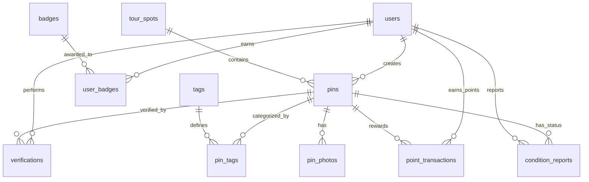

# 🌲 2026 관광데이터 활용 공모전 - Backend API

FastAPI 기반의 자연 힐링 플랫폼 백엔드 서비스입니다. 공공 API(TourAPI 4.0)의 거시 명소 정보 위에 사용자가 등록한 미시 핀 좌표, 사진 EXIF 검증, 게이미피케이션(인증/뱃지) 서비스를 제공합니다.

---

## 🏗️ 데이터베이스 스키마 설계 (DB Schema)

관계형 데이터베이스(RDB) 구조 설계안입니다.



### 1. `users` (사용자 테이블)
- `id` (INT, PK, Auto Increment)
- `email` (VARCHAR, Unique, Nullable)
- `nickname` (VARCHAR, Unique)
- `level` (INT, Default 1)
- `points` (INT, Default 0)
- `created_at` (TIMESTAMP, Default NOW)

### 2. `tour_spots` (관광공사 공공 API 명소 테이블 - 베이스 맵)
- `id` (INT, PK) : TourAPI의 `contentid` 값을 그대로 매핑
- `title` (VARCHAR) : 명소 이름 (예: 남산공원, 북한산 등)
- `mapx` (DOUBLE) : 경도 (Longitude)
- `mapy` (DOUBLE) : 위도 (Latitude)
- `firstimage` (VARCHAR, Nullable) : 기본 대표 이미지 URL
- `overview` (TEXT, Nullable) : 명소 개요
- `created_at` (TIMESTAMP)

### 3. `pins` (미시 좌표 핀 테이블)
- `id` (INT, PK, Auto Increment)
- `tour_spot_id` (INT, FK -> `tour_spots.id`) : 소속된 공공 명소
- `user_id` (INT, FK -> `users.id`) : 등록자
- `title` (VARCHAR) : 핀 이름 (예: '물소리가 잘 들리는 벤치')
- `description` (TEXT) : 핀 상세 정보 및 메모
- `latitude` (DOUBLE) : 정밀 위도
- `longitude` (DOUBLE) : 정밀 경도
- `is_blurred` (BOOLEAN, Default False) : 민감지역 좌표 흐림 처리 여부 (500m 반경 등)
- `reliability_score` (INT, Default 0) : 다른 사용자의 인증수(Verification) 기반 신뢰도 점수
- `last_status_checked_at` (TIMESTAMP) : 최종 유효 확인 일시 ("지금도 그대로인가요?")
- `created_at` (TIMESTAMP, Default NOW)

### 4. `pin_photos` (핀 사진 테이블)
- `id` (INT, PK, Auto Increment)
- `pin_id` (INT, FK -> `pins.id`)
- `photo_url` (VARCHAR) : 저장된 사진 S3/스토리지 주소
- `exif_latitude` (DOUBLE, Nullable) : 사진 EXIF에서 추출한 위도
- `exif_longitude` (DOUBLE, Nullable) : 사진 EXIF에서 추출한 경도
- `exif_taken_at` (TIMESTAMP, Nullable) : 사진 촬영 일시
- `is_validated` (BOOLEAN, Default False) : EXIF 좌표와 핀 등록 좌표 일치 여부 검증 성공 상태
- `created_at` (TIMESTAMP, Default NOW)

### 5. `tags` 및 `pin_tags` (경험 태그 테이블)
- `tags` (태그 마스터)
  - `id` (INT, PK, Auto Increment)
  - `name` (VARCHAR, Unique) : 태그 이름 (예: 물멍벤치)
  - `is_danger` (BOOLEAN, Default False) : 위험 구역 유무 (True 일 경우 사용자에게 주의 표시)
- `pin_tags` (매핑 테이블)
  - `pin_id` (INT, FK -> `pins.id`, PK)
  - `tag_id` (INT, FK -> `tags.id`, PK)

### 6. `verifications` (방문 인증 및 신뢰도 테이블)
- `id` (INT, PK, Auto Increment)
- `pin_id` (INT, FK -> `pins.id`)
- `user_id` (INT, FK -> `users.id`)
- `photo_url` (VARCHAR, Nullable) : 인증용 촬영 이미지 (선택)
- `is_still_there` (BOOLEAN) : "지금도 그대로인가요?" 질문에 대한 답변 (True/False)
- `is_validated` (BOOLEAN, Default False) : 인증 사진의 EXIF 좌표가 핀 좌표와 일치하는지 여부
- `created_at` (TIMESTAMP, Default NOW)

> `pins.reliability_score`는 이 테이블로부터 매번 재계산됩니다.
> 등록 사진 EXIF 검증 +1, '그대로예요' +1 (현장 사진까지 검증되면 +2), '없어졌어요' -2.

### 7. `condition_reports` (실시간 컨디션 리포트 테이블)
- `id` (INT, PK, Auto Increment)
- `pin_id` (INT, FK -> `pins.id`)
- `user_id` (INT, FK -> `users.id`)
- `status_type` (VARCHAR) : 예: `CROWDED`(붐빔), `QUIET`(조용함), `TEMPORARILY_CLOSED`(임시통제)
- `created_at` (TIMESTAMP, Default NOW)

### 8. `badges` 및 `user_badges` (보상/게이미화 테이블)
- `badges` (뱃지 마스터)
  - `id` (INT, PK, Auto Increment)
  - `code` (VARCHAR, Unique) : 지급 키 (예: `PIONEER`). 표시 이름과 달리 바뀌지 않습니다.
  - `name` (VARCHAR, Unique) : 뱃지 이름
  - `description` (VARCHAR) : 획득 조건 설명
  - `icon_url` (VARCHAR) : 뱃지 아이콘. 현재는 이모지 문자열을 담습니다.
- `user_badges` (유저별 뱃지 매핑)
  - `user_id` (INT, FK -> `users.id`, PK)
  - `badge_id` (INT, FK -> `badges.id`, PK)
  - `created_at` (TIMESTAMP, Default NOW)

> 뱃지 지급 조건은 `app/services/badge_rules.py`에 정의되어 있고,
> 마스터 데이터는 `python -m app.scripts.seed_badges` 로 시딩합니다.

### 9. `point_transactions` (포인트 적립 내역 테이블)
- `id` (INT, PK, Auto Increment)
- `user_id` (INT, FK -> `users.id`) : 포인트를 받은 사용자
- `amount` (INT) : 적립 포인트
- `reason` (VARCHAR) : 적립 사유 코드 (아래 정책 표 참고)
- `pin_id` (INT, FK -> `pins.id`, Nullable, ON DELETE SET NULL) : 근거가 된 핀
- `verification_id` (INT, FK -> `verifications.id`, Nullable, ON DELETE SET NULL) : 근거가 된 인증
- `created_at` (TIMESTAMP, Default NOW)

> `users.points`는 이 테이블의 합계입니다. 근거가 된 핀/인증이 지워져도 적립 내역 자체는 남습니다.

---

## 🎮 게이미피케이션 정책

지급 금액과 화면 문구는 `app/services/gamification_service.py`의 `POINT_REASONS` 한 곳에서 관리합니다.

### 포인트

| 이벤트 | reason | 지급 | 대상 |
|---|---|---|---|
| 핀 등록 (EXIF 미검증) | `PIN_CREATE` | +100 P | 등록자 |
| 핀 등록 (EXIF 검증 성공) | `PIN_CREATE_VALIDATED` | +150 P | 등록자 |
| 방문 인증 (사진 없음/미검증) | `VERIFY` | +30 P | 인증자 |
| 방문 인증 (현장 사진 EXIF 검증) | `VERIFY_VALIDATED` | +50 P | 인증자 |
| 내 핀을 남이 '그대로예요'로 인증 | `PIN_VERIFIED_BY_OTHER` | +20 P | 핀 등록자 |

'없어졌어요' 응답도 기여로 보아 인증자에게는 지급하되, 핀 등록자에게는 지급하지 않습니다.
포인트 적립은 핀/인증과 **같은 트랜잭션**에서 이뤄져 둘 중 하나만 남는 상황이 생기지 않습니다.

### 레벨

`level = points // 100 + 1` (100P마다 1레벨).

### 뱃지

| code | 이름 | 조건 |
|---|---|---|
| `PIONEER` | 첫 발견자 (Pioneer) | 아직 핀이 없던 명소에 1호 핀 등록 |
| `LOCAL_MASTER` | 지역 마스터 (Local Master) | 한 명소에 핀 5개 이상 등록 |
| `EXPLORER` | 산악인 (Explorer) | 방문 인증 10회 |
| `WATER_MEDITATION` | 물멍 고수 (Water Meditation) | 물멍/계곡 계열 태그 핀 5회 인증 |
| `PHOTOGRAPHER` | 내셔널 지오그래픽 (Photographer) | EXIF 검증된 핀 20개 등록 |

미획득 뱃지는 `current/goal` 진행도를 함께 내려보내 '3/5 달성 중' 표기와 챌린지 현황판에 재사용합니다.

---

## 🛠 스키마 반영 및 시딩

```bash
python -m app.scripts.migrate_schema        # 없는 테이블 생성 + 누락 컬럼 추가
python -m app.scripts.seed_tags             # 경험/주의 태그 시딩
python -m app.scripts.seed_badges           # 뱃지 마스터 시딩
python -m app.scripts.backfill_gamification # 기존 핀·인증에 포인트/뱃지 소급 적용 (재실행 안전)
```
